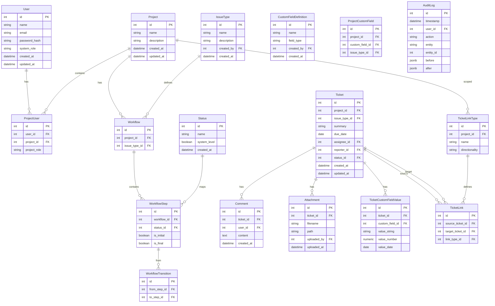

```mermaid
erDiagram
    User ||--o{ ProjectUser: has
    Project ||--o{ ProjectUser: contains
    Project ||--o{ Workflow: has
    IssueType ||--o{ Workflow: defines
    Workflow ||--o{ WorkflowStep: contains
    WorkflowStep ||--o{ WorkflowTransition: from
%%    WorkflowStep ||--o{ WorkflowTransition: to
    Status ||--o{ WorkflowStep: maps
    Ticket ||--o{ Comment: has
    Ticket ||--o{ Attachment: has
    Ticket ||--o{ TicketCustomFieldValue: has
    Ticket ||--o{ TicketLink: source
    Ticket ||--o{ TicketLink: target
    TicketLinkType ||--o{ TicketLink: defines
    Project ||--o{ TicketLinkType: scoped

    User {
        int id PK
        string name
        string email
        string password_hash
        string system_role
        datetime created_at
        datetime updated_at
    }

    Project {
        int id PK
        string name
        string description
        datetime created_at
        datetime updated_at
    }

    ProjectUser {
        int id PK
        int user_id FK
        int project_id FK
        string project_role
    }

    IssueType {
        int id PK
        string name
        string description
        int created_by FK
        datetime created_at
    }

    Status {
        int id PK
        string name
        boolean system_level
        datetime created_at
    }

    Workflow {
        int id PK
        int project_id FK
        int issue_type_id FK
    }

    WorkflowStep {
        int id PK
        int workflow_id FK
        int status_id FK
        boolean is_initial
        boolean is_final
    }

    WorkflowTransition {
        int id PK
        int from_step_id FK
        int to_step_id FK
    }

    Ticket {
        int id PK
        int project_id FK
        int issue_type_id FK
        string summary
        date due_date
        int assignee_id FK
        int reporter_id FK
        int status_id FK
        datetime created_at
        datetime updated_at
    }

    Comment {
        int id PK
        int ticket_id FK
        int user_id FK
        text content
        datetime created_at
    }

    Attachment {
        int id PK
        int ticket_id FK
        string filename
        string path
        int uploaded_by FK
        datetime uploaded_at
    }

    CustomFieldDefinition {
        int id PK
        string name
        string field_type
        int created_by FK
        datetime created_at
    }

    ProjectCustomField {
        int id PK
        int project_id FK
        int custom_field_id FK
        int issue_type_id FK
    }

    TicketCustomFieldValue {
        int id PK
        int ticket_id FK
        int custom_field_id FK
        string value_string
        numeric value_number
        date value_date
    }

    TicketLinkType {
        int id PK
        int project_id FK
        string name
        string directionality
    }

    TicketLink {
        int id PK
        int source_ticket_id FK
        int target_ticket_id FK
        int link_type_id FK
    }

    AuditLog {
        int id PK
        datetime timestamp
        int user_id FK
        string action
        string entity
        int entity_id
        jsonb before
        jsonb after
    }

```
