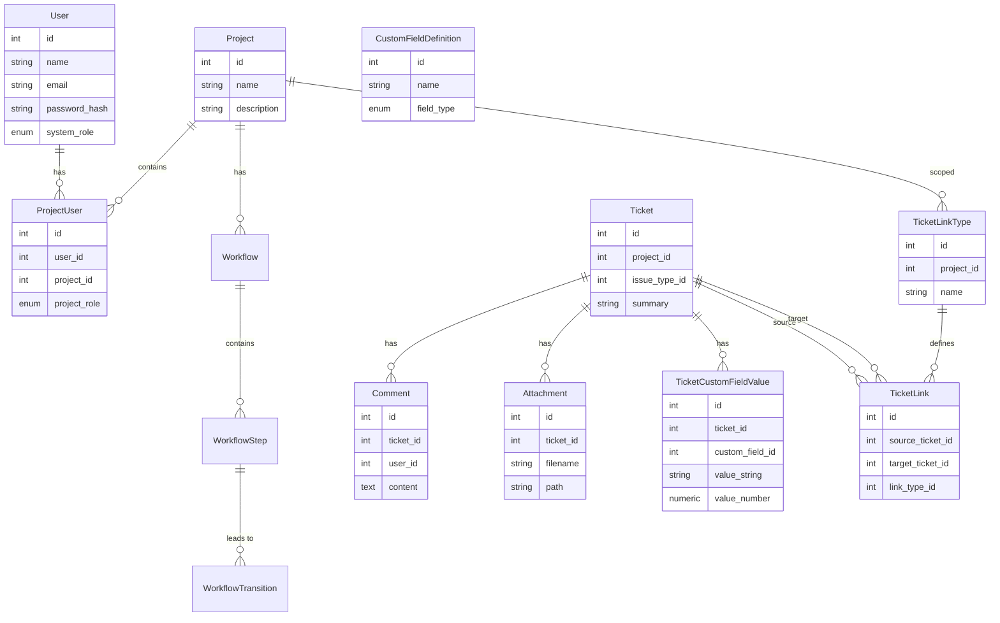

```mermaid
erDiagram
    User ||--o{ ProjectUser : "has"
    Project ||--o{ ProjectUser : "contains"
    Project ||--o{ Workflow : "has"
    Workflow ||--o{ WorkflowStep : "contains"
    WorkflowStep ||--o{ WorkflowTransition : "leads to"
    Ticket ||--o{ Comment : "has"
    Ticket ||--o{ Attachment : "has"
    Ticket ||--o{ TicketCustomFieldValue : "has"
    Ticket ||--o{ TicketLink : "source"
    Ticket ||--o{ TicketLink : "target"
    TicketLinkType ||--o{ TicketLink : "defines"
    Project ||--o{ TicketLinkType : "scoped"

    User {
        int id
        string name
        string email
        string password_hash
        enum system_role
    }
    Project {
        int id
        string name
        string description
    }
    ProjectUser {
        int id
        int user_id
        int project_id
        enum project_role
    }
    Ticket {
        int id
        int project_id
        int issue_type_id
        string summary
    }
    Comment {
        int id
        int ticket_id
        int user_id
        text content
    }
    Attachment {
        int id
        int ticket_id
        string filename
        string path
    }
    CustomFieldDefinition {
        int id
        string name
        enum field_type
    }
    TicketCustomFieldValue {
        int id
        int ticket_id
        int custom_field_id
        string value_string
        numeric value_number
    }
    TicketLink {
        int id
        int source_ticket_id
        int target_ticket_id
        int link_type_id
    }
    TicketLinkType {
        int id
        int project_id
        string name
    }

```
