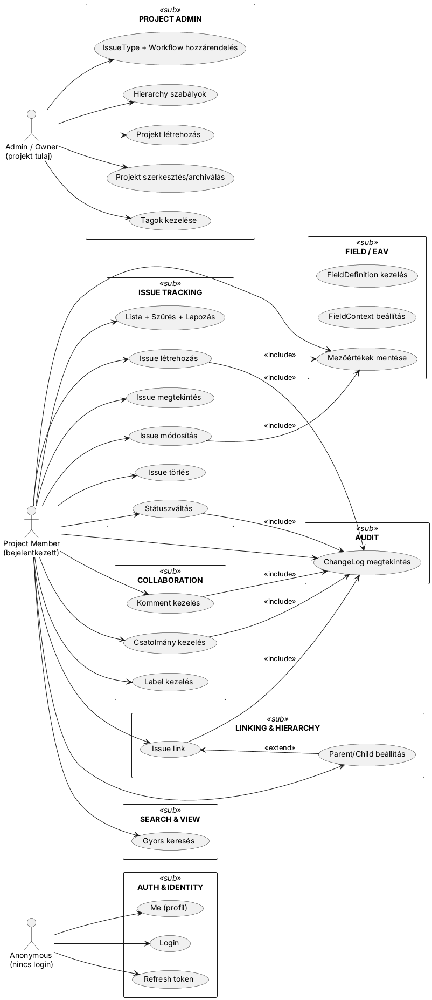

# Követelmény specifikáció (MVP Ticketing System)

Ez a dokumentum a szakdolgozat keretében megvalósítandó Jira-szerű ticketing rendszer **funkcionális követelményeit**
írja le.  
Az MVP a biztosan szállítható minimumot tartalmazza (értesítések, Kanban, haladó jogosultságok és komplex keresés
nélkül).

---

## Use-case diagram

A fő funkciókat és aktorokat az alábbi PlantUML ábra szemlélteti.  
Az ábra tartalmazza a nagyobb **alrendszerek téglalapokkal** való elkülönítését, az **aktorokat**, és a köztük lévő *
*relációkat**.

Követelmények
-------------
