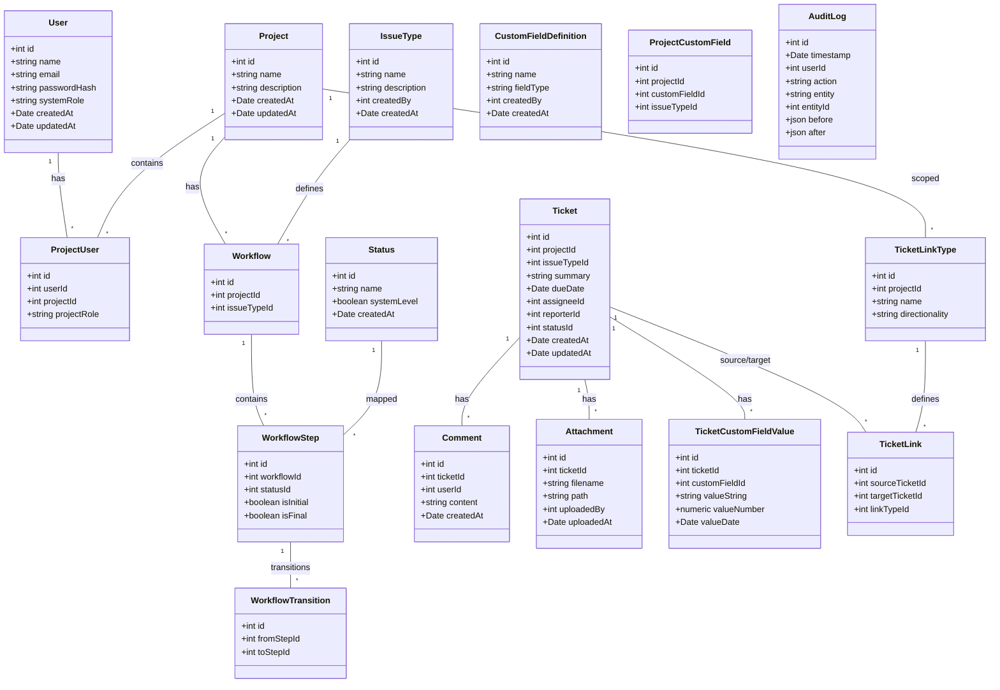

```mermaid
classDiagram
    class User {
        +int id
        +string name
        +string email
        +string passwordHash
        +string systemRole
        +Date createdAt
        +Date updatedAt
    }

    class Project {
        +int id
        +string name
        +string description
        +Date createdAt
        +Date updatedAt
    }

    class ProjectUser {
        +int id
        +int userId
        +int projectId
        +string projectRole
    }

    class IssueType {
        +int id
        +string name
        +string description
        +int createdBy
        +Date createdAt
    }

    class Status {
        +int id
        +string name
        +boolean systemLevel
        +Date createdAt
    }

    class Workflow {
        +int id
        +int projectId
        +int issueTypeId
    }

    class WorkflowStep {
        +int id
        +int workflowId
        +int statusId
        +boolean isInitial
        +boolean isFinal
    }

    class WorkflowTransition {
        +int id
        +int fromStepId
        +int toStepId
    }

    class Ticket {
        +int id
        +int projectId
        +int issueTypeId
        +string summary
        +Date dueDate
        +int assigneeId
        +int reporterId
        +int statusId
        +Date createdAt
        +Date updatedAt
    }

    class Comment {
        +int id
        +int ticketId
        +int userId
        +string content
        +Date createdAt
    }

    class Attachment {
        +int id
        +int ticketId
        +string filename
        +string path
        +int uploadedBy
        +Date uploadedAt
    }

    class CustomFieldDefinition {
        +int id
        +string name
        +string fieldType
        +int createdBy
        +Date createdAt
    }

    class ProjectCustomField {
        +int id
        +int projectId
        +int customFieldId
        +int issueTypeId
    }

    class TicketCustomFieldValue {
        +int id
        +int ticketId
        +int customFieldId
        +string valueString
        +numeric valueNumber
        +Date valueDate
    }

    class TicketLinkType {
        +int id
        +int projectId
        +string name
        +string directionality
    }

    class TicketLink {
        +int id
        +int sourceTicketId
        +int targetTicketId
        +int linkTypeId
    }

    class AuditLog {
        +int id
        +Date timestamp
        +int userId
        +string action
        +string entity
        +int entityId
        +json before
        +json after
    }

    User "1" -- "*" ProjectUser: has
    Project "1" -- "*" ProjectUser: contains
    Project "1" -- "*" Workflow: has
    IssueType "1" -- "*" Workflow: defines
    Workflow "1" -- "*" WorkflowStep: contains
    WorkflowStep "1" -- "*" WorkflowTransition: transitions
    Status "1" -- "*" WorkflowStep: mapped
    Ticket "1" -- "*" Comment: has
    Ticket "1" -- "*" Attachment: has
    Ticket "1" -- "*" TicketCustomFieldValue: has
    Ticket "1" -- "*" TicketLink: source/target
    TicketLinkType "1" -- "*" TicketLink: defines
    Project "1" -- "*" TicketLinkType: scoped

```
